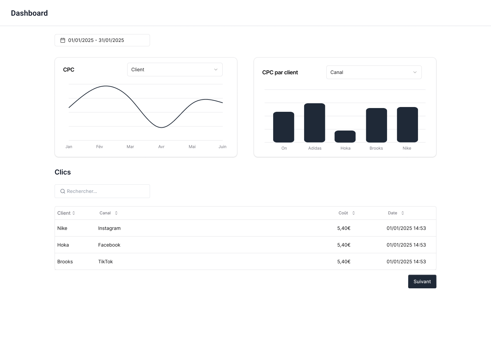

# Test technique — React + Node/TS



## Bienvenue 👋

L’objectif est simple : évaluer vos compétences en **architecture backend**, en **gestion de données**, et en **développement frontend** autour d’un petit projet de **Business Intelligence**.

👉 Ce test est conçu pour être réalisé en **une demi-journée maximum**.  
👉 Une fois terminé, merci de le remettre dans un **dépôt GitHub privé** et de nous y inviter.

**Lexique :** 
- CPC (coût par clic) : coût moyen d'un clic sur une période et/ou un segment donnée (jour, client, canal...).

## Starter kit

Pour gagner du temps, un **starter kit** vous est fourni avec :

- **Backend**
  - API fonctionnelle avec **Fastify**
  - **DuckDB** pour requêter les données (Fichier Parquet) en SQL
  - **Vitest** pour les tests unitaires

- **Frontend**
  - **Next.js** (React 18 + TypeScript)
  - **shadcn/ui** (UI kit basé sur Radix + Tailwind)
  - **React Query** déjà connecté à l’API

- **Figma** : https://www.figma.com/design/pf88WPLLP7hZclFo3AnsNP/BI-React-Node-Technical-test?node-id=0-1&t=oVCGj9d0lkNINjkg-1

> Le **Figma est fourni**  à titre indicatif, vous êtes libre d'intégrer le design de votre choix.
>
> **Priorité au backend** : architecture modulaire (Collectors / Calculators / Requests), validation, tests, performance.
> 
> Vous n’avez **pas besoin de tout réinventer** : le but est d’étendre et d’architecturer proprement.

## Librairies conseillées
- **shadcn/ui** → composants UI (cards, table, date picker, etc.)
- **Recharts** → graphiques (bar/line chart)
- **Zustand** → gestion d’état simple et scalable côté frontend
- **React Table** → tableaux filtrables/paginés
- **React Query** → data fetching (déjà intégré au starter)
- **Zod** → validation données au runtime
- **DuckDB** → pour requêter les données (Fichier Parquet) en SQL

👉 Vous êtes libre d’utiliser **les librairies de votre choix**, tant que l’architecture et les fonctionnalités demandées sont respectées.

## Données fournies

- Un fichier parquet (`data/clicks.parquet`)
- Clients : Nike, Adidas, Hoka, On, Brooks
- Canaux : Instagram, Tiktok, Facebook, Google
- Période : 2024-01-01 → 2025-09-01
- Entre 50 et 200 clics par jour et par client
- Format : client,canal,cost,datetime
- cost ∈ [0.30 ; 10.00] (€/clic)

## Architecture back-end attendue

### Interfaces

```ts
// Pour chacunes de ces interfaces, des paramètres peuvent être passés dans le constructeur
export interface Collector<TData> { load(): Promise<TData>; }
export interface Calculator<TInput, TOutput> { compute(input: TInput): Promise<TOutput>; }
export interface Request<TResponse> { execute(params: RequestParams): Promise<TResponse>; }
```

### Flux

`Request.execute(params)` :
- appelle un Collector (lecture parquet + pré-filtres),
- appelle un Calculator (logique métier / KPIs),
- renvoie un DTO stable qui sera directement retourné par la route.

## API à implémenter

### 1) CPC (Série temporelle)

`GET /cpc/series?date_from=&date_to=&client=`

- date_from : obligatoire
- date_to : obligatoire
- client : optionnel, si non précisé tous les clients sont aggrégés

```json
[
  {"date":"2024-01-01","cpc":1.84,"count":1245},
  {"date":"2024-01-02","cpc":1.73,"count":1180}
]
```

### 2) CPC par client

`GET /cpc/by-client?date_from=&date_to=&canal=`

- date_from : obligatoire
- date_to : obligatoire
- canal : optionnel, si non précisé tous les canaux sont aggrégés

```json
[
  {"client":"On","cpc":1.62,"count":982},
  {"client":"Adidas","cpc":1.87,"count":1011},
  {"client":"Hoka","cpc":0.95,"count":940}
]
```


### 3) Liste des 5 000 derniers clics

`GET /clicks?date_from=&date_to=`

```json
[
  {"client":"Nike","canal":"Instagram","cost":5.40,"datetime":"2024-01-01 14:53:00"},
  {"client":"Hoka","canal":"Facebook","cost":5.40,"datetime":"2024-01-01 14:53:00"}
]
```

## Front à implémenter

- Date range picker (par défaut : 01/01/2025 → 31/01/2025).
- Line chart (CPC) : `GET /cpc/series?date_from=&date_to=&client=`
- Bar chart (CPC par client) : `GET /cpc/by-client?date_from=&date_to=&canal=`
- Table “Clics” : `GET /clicks?date_from=&date_to=`
  - recherche côté client sur client/canal
  - pagination
  - colonnes : Client / Canal / Coût / Date.

## Tests exigés

- 1 test unitaire de Calculator
- 1 test unitaire de Request

## Livrables attendus

- Repo GitHub privé contenant :
    - FEEDBACK.md (explications de l'architecture, des choix techniques, avis sur le test et commentaires).
    - Les modifications effectuées sur le code.
- Commits progressifs.
- Invitez-nous en tant que collaborateurs sur le dépôt privé.

## Barème (100 pts)

- Architecture & DIC (35)
- Calcul & exactitude (20)
- Qualité code (15)
- Frontend & data-viz (15)
- Tests (10)
- Doc (5)
